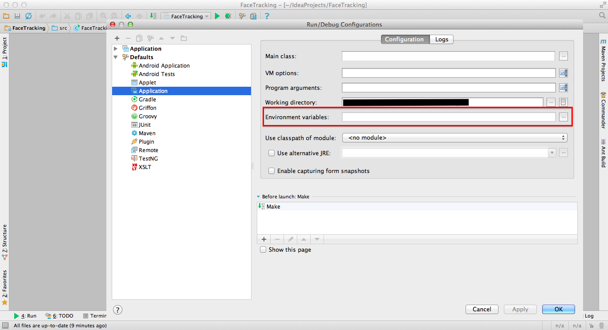
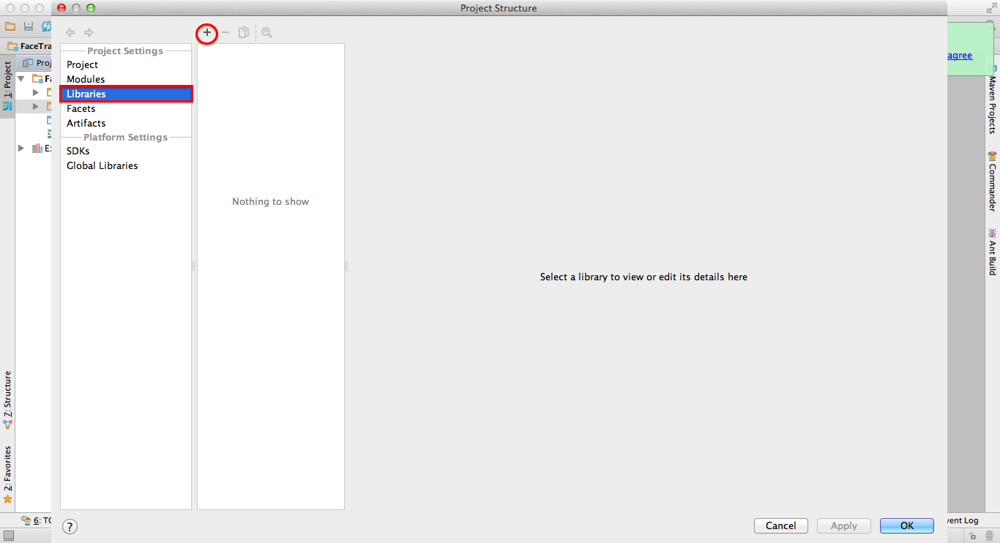
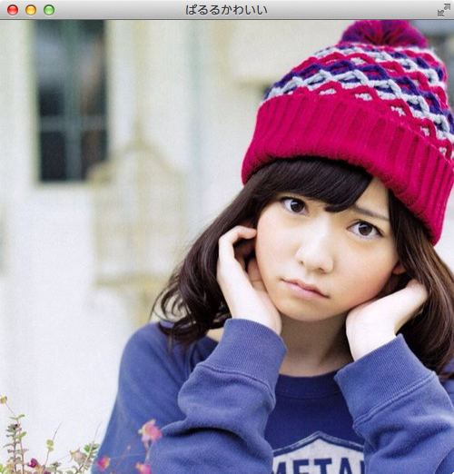
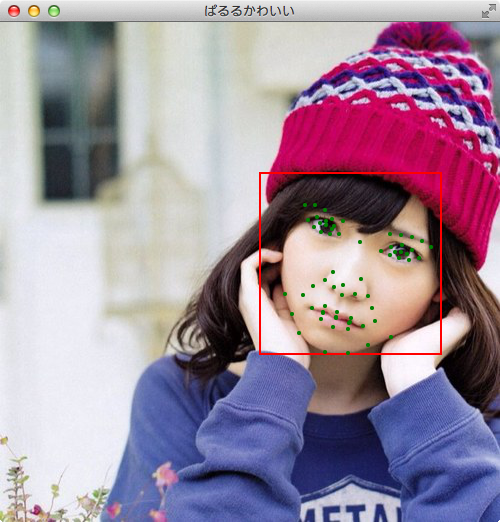

##Luxand faceSDKを使った<br />顔認識
あべけー(2014.07.03)


####Luxand faceSDKとは
Luxand社が提供している画像からの  
顔認識、特徴発見のためのSDK


####使用できる言語
- C++
- C#
- Objective-C
- Java
- Visual Basic
- Delphi


###インストール環境
- OS: Mac OSX Merverics
- 使用言語: Java
- Java環境: Intellij IDEA CE 13


###SDKダウンロード
MacOSX用は.tar.bz2ファイル  
[Luxand-Downloads](https://www.luxand.com/facesdk/download/)


###必要なファイル
解凍したフォルダ内で必要なファイル

- bin/osx\_x86\_64/libfsdk.dylib
- include/Java/FaceSDK.jar
- include/Java/jna.jar


###プロジェクト作成・設定


Intellij IDEA CEを起動し、SDKを使うための設定をしていきます。
起動できたら新規プロジェクトを作成しよう。


Run -> Edit configurationsからDefault -> Applicationを選択。
Environment variablesの欄から環境変数DYLD\_LIBRARY\_PATHにlibfsdk.dylibを保存したディレクトリを指定。



File -> Project structureからLibrariesを選択。FaceSDK.jarとjna.jarを追加。



ライブラリを使用できるようにLuxandの[ページ](http://luxand.com/facesdk/requestkey/)からevaluation keyを取得しておこう。

keyを手に入れたらFaceSDKが使えるようになったよ。次は実際にプログラムを書いてみよう。


###FaceTracking
顔を認識して特徴点を取り出すプログラムをサンプルにFaceSDKの使い方を確認していくよ。


###アクティベーション
```
import Luxand.FSDK;
import Luxand.FSDK.*;

public class FaceTracking {
    private static final String FSDK_LICENSE_KEY = "";

    public static void main(String args[]) {
        int result = FSDK.ActivateLibrary(FSDK_LICENSE_KEY);
        if(result == FSDK.FSDKE_OK) {
            System.out.println("Activation SUCCESS!");
        }
        else {
            System.out.println("Activation FAILED...");
        }
    }
}
```
FaceSDKを使う前にActivationLibrary関数にevaluation keyを渡してアクティベートしよう。
うまくいかないときはkeyが正しいかやライブラリにパスが通っているかを確認してみよう。


###初期化と終了処理
```
public static void main(String args[]) {
    int result = FSDK.ActivateLibrary(FSDK_LICENSE_KEY);
    if(result != FSDK.FSDKE_OK) {
        System.out.println("Activation FAILED...");
        System.exit(-1);
    }
    FSDK.Initialize();
    
    FSDK.Finalize();
}
```
アクティベートしたあとはFSDKを初期化し、プログラムが終了する前にファイナライズしよう。

実際の処理はInitialize()とFinalize()の間に記述していくよ。


###画像の読み込み
```
HImage imageHandle = new HImage();
result = FSDK.LoadImageFromFile(imageHandle, "parurukawaii.jpg");
if(result != FSDK.FSDKE_OK) {
    System.out.println("EROOR! code: " + Integer.toString(result) + "failed to load image from file");
    System.exit(-1);
}
```
imageHandleオブジェクトを作って、LoadImageFromFile関数で画像を読み込むことができるよ。


###顔認識
```
TFacePosition.ByReference facePosition = new TFacePosition.ByReference();
result = FSDK.DetectFace(imageHandle, facePosition);
if(result != FSDK.FSDKE_OK) {
    if(result == FSDK.FSDKE_FACE_NOT_FOUND) {
        System.out.println("cannot detect a face.");
        System.exit(0);
    }
    else {
        System.out.println("EROOR! code: " + Integer.toString(result) + " failed to detect a face");
        System.exit(-1);
    }
}
System.out.println("face center position x:" + Integer.toString(facePosition.xc));
System.out.println("face center position y:" + Integer.toString(facePosition.yc));
System.out.println("face position width   :" + Integer.toString(facePosition.w));
System.out.println("face angle            :" + Double.toString(facePosition.angle));
```
読み込んだ画像に顔が検出できれば顔の中心の座標、幅、角度を取得することができる。


###特徴点抽出
```
FSDK_Features.ByReference facialFeatures = new FSDK_Features.ByReference();
FSDK.DetectFacialFeatures(imageHandle, facialFeatures);
```
facialFeatures.features[]に66個の特徴点が入っている。配列のどこにどの点が入っているのかは[公式のドキュメント](http://luxand.com/facesdk/documentation/detectedfeatures.php)を参照してね。


###JavaFXを使ったGUIの表示
今までのコードを少しだけ書きかえてみよう。
```
import Luxand.FSDK;
import Luxand.FSDK.*;
import javafx.application.Application;
import javafx.stage.Stage;

public class FaceTracking extends Application {
    private static final String FSDK_LICENSE_KEY = "";
    
    public static void main(String args[]) {
        int result = FSDK.ActivateLibrary(FSDK_LICENSE_KEY);
        FSDK.Initialize();
        launch(args);
        FSDK.Finalize();
    }
    
    @Override
    public void start(Stage stage) throws Exception {
        
        /* FaceSDKを使ったコード */
        
    }
}
```


###画像の表示
```
// 画像サイズの取得
int w[] = new int[1];
int h[] = new int[1];
FSDK.GetImageWidth(imageHandle, w);
FSDK.GetImageHeight(imageHandle, h);

Group root = new Group();

// 画像読み込み
ImageView imageView = new ImageView(new Image("parurukawaii.jpg", w[0], h[0], false, false));
root.getChildren().add(imageView);

// 描画
Scene scene = new Scene(root);
stage.setTitle("ぱるるかわいい");
stage.setScene(scene);
stage.show();
```



###顔の周りを囲む
描画の前にこのコードを挿入しよう
```
Rectangle rectangle = new Rectangle();
rectangle.setX(facePosition.xc - (int) (facePosition.w * 0.5));
rectangle.setY(facePosition.yc - (int) (facePosition.w * 0.5));
rectangle.setWidth(facePosition.w);
rectangle.setHeight(facePosition.w);
rectangle.setStroke(Color.RED);
rectangle.setStrokeWidth(2.0);
rectangle.setFill(Color.TRANSPARENT);
//rectangle.getTransforms().add(new Rotate(facePosition.angle, facePosition.w * 0.5, facePosition.w * 0.5));
root.getChildren().add(rectangle);
```


###特徴点を打つ
```
for(int i = 0; i < FSDK.FSDK_FACIAL_FEATURE_COUNT; i++) {
    Circle circle = new Circle();
    circle.setFill(Color.GREEN);
    circle.setCenterX(facialFeatures.features[i].x);
    circle.setCenterY(facialFeatures.features[i].y);
    circle.setRadius(2.0);
    root.getChildren().add(circle);
}
```
