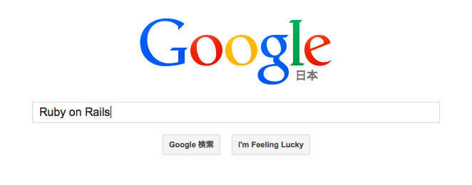
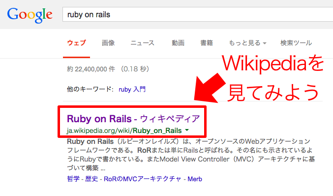
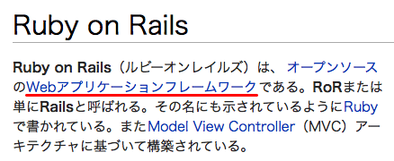
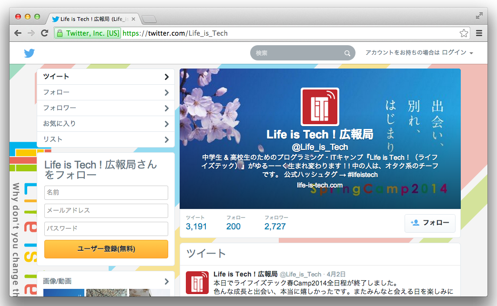
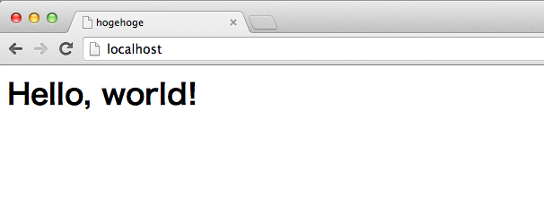

##Rails イントロダクション
あべけー(2014.04.04)

<small>※イントロダクション: 入門、紹介</small>


##Ruby on Railsってなに？
 <!-- .element: style="border: none;" -->


###Googleで検索してみよう！ <!-- .element: class="icon" -->
`https://www.google.co.jp`



###検索してみると... <!-- .element: class="icon" -->



###Wikipediaにはこんなことが書いてる <!-- .element: class="icon" -->
`http://ja.wikipedia.org/wiki/Ruby_on_Rails`



###Webアプリケーション<br />フレームワーク？？
簡単に言うと、Webサイトを簡単にプログラミングするためのルールを決めてくれる枠組み(＝フレームワーク)


##そもそもなんでWebサイトをプログラミングするの？


###Twitterのようなページを作りたい <!-- .element: class="icon" -->



###だけど、
ユーザー登録やログイン、テキストを投稿することが  
htmlだけではできない！！


###htmlの書き方

```
<!DOCTYPE html>
<html>
<head>
  <title>hogehoge</title>
</head>
<body>
  <h1>Hello, world!</h1>
</body>
</html>
```

<small>※このhtmlの意味はどうなっている？</small>




###プログラムがhtmlを作る
ユーザーごとに違う数字や文字を使ったりしてhtmlを作ることがプログラムでできる！(※)

<small>※このプログラムが動いているコンピュータのことをサーバー、プログラムを書くことをサーバーサイドプログラミングと言うよ！</small>

ログインなどはhtmlを作るわけじゃないけどプログラムで出来るようになる！


###Webアプリケーションいろいろ
みんなが知っているYoutubeやGoogleもプログラムで動いていて、Webブラウザで見れるものをWebアプリケーションという

Railsで作られていたWebアプリケーションにはCookpadやTwitter、LinkedInなどがあるよ！

<small>Railsの他にWebに使われているプログラミング言語はPHPやNode.js、Perl、Javaなどがあるよ。興味がある人はメンターさんに聞いてみよう。</small>


##まとめ

- プログラムを使ってhtmlだけでできないことができる
- プログラムを書きやすくするフレームワークというものがあり、Railsはその1つ


##補足 - (未完成)
ここから先は少し難しいので興味がある人は読んでみてね。


###HTML(HyperText Markup Language)
文章(Text)に意味を印づける(Markup)ための言語をマークアップ言語といい、HTMLは<>で囲まれたタグを使う。Webの基盤技術であり、HyperTextとはハイパーリンク(文書間の参照)を他の文書に貼ることができるテキストのことである。


###HTTP(HyperText Transfer Protocol)
HyperTextを転送(Transfer)するための約束事(Protocol)と訳すことができる。  
実はHyperText以外にも様々なデータ形式を扱うことができる。  
リクエストに対してレスポンスを返す基本構造を持つ。


###Rack
サーバーとアプリケーションの間を抽象化するインターフェース


###MVC(Model View Controller)アーキテクチャ


###DRY、CoC
- Don't Repeat Yourself
- Convention over Configuration


###データベース、O/R Mapper


